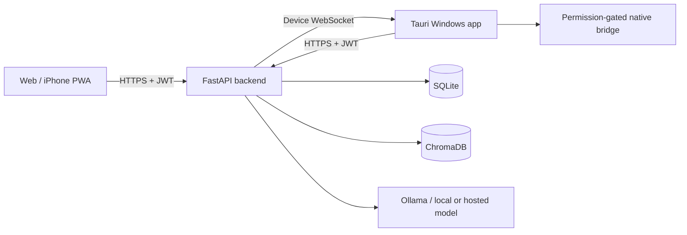

# SALAR v1 Production Specification

## Product outcome

SALAR is a private, multi-surface AI assistant delivered as a Windows desktop application and an installable responsive web/PWA client. Every client communicates with one authenticated FastAPI backend over HTTPS. The Windows application also maintains a device WebSocket so commands submitted from a phone or browser can be relayed to the user's PC after policy checks.

## Delivery scope

- Windows installer (`.exe`) built with Tauri 2 and NSIS.
- Static website directory ready for domain hosting.
- Docker-ready FastAPI backend for a public HTTPS API domain.
- Responsive React client shared by desktop, web, and mobile PWA.
- Password login, JWT sessions, API tokens, CORS allow-list, audit log, and sensitive-action confirmation.
- Ollama-backed chat with a deterministic offline fallback when Ollama is unavailable.
- Conversation history, layered memories, projects, settings, and task records in SQLite.
- Document upload and extraction for PDF, DOCX, text, Markdown, JSON, and source code.
- ChromaDB-backed semantic retrieval with a SQLite keyword fallback.
- Device registration, presence, remote command queue, WebSocket relay, and execution results.
- Safe desktop actions: open an approved application, open a URL, reveal a path, create a folder, and report system information. Destructive or arbitrary shell actions are excluded from v1.
- Approved visual system: Strands loading screen, exact LiquidEther dashboard background, and exact MagicRings Live Mode background.

## Architecture



The backend is the source of truth for users, conversations, memories, documents, tasks, devices, and audit events. The React application is built once; Tauri loads the same compiled assets used for web deployment. Browser and phone clients never receive native execution privileges. Only an authenticated desktop device connection can accept an automation command.

## Monorepo structure

```text
backend/                 FastAPI application and tests
frontend/                React/Vite/PWA shared client
desktop/src-tauri/       Tauri shell and Rust native command policy
docs/                    Architecture, deployment, security, and operator guides
docker/                  Backend container and reverse-proxy configuration
scripts/                 Build and release automation
dist/website/            Verified static web artifact
dist/installer/          Verified Windows installer artifact
```

## Security model

- Passwords use Argon2 hashing.
- Access tokens are short-lived signed JWTs; refresh is performed by logging in again in v1.
- The first account is created from deployment bootstrap variables, not a public registration endpoint.
- CORS origins must be explicitly configured.
- Device WebSockets authenticate with a device token created by the logged-in user.
- Remote commands are typed and schema-validated; arbitrary shell commands are rejected.
- Every login, document mutation, memory mutation, command request, approval, execution, and failure is written to the audit log.
- Sensitive commands remain `pending_confirmation` until approved by a logged-in client.

## Internet deployment

The website and API use separate configurable origins, for example `https://salar.example.com` and `https://api.salar.example.com`. Caddy terminates TLS and proxies API/WebSocket traffic to FastAPI. The frontend reads `VITE_API_URL` at build time; the desktop app also allows the API URL to be changed in Settings. No production client is hard-coded to localhost.

## Acceptance criteria

1. A fresh backend starts from documented environment variables and passes its test suite.
2. A user can sign in, create conversations, chat, save memories, upload/search documents, and review audit events.
3. The PWA installs on a mobile browser and uses the configured internet API URL.
4. A remote automation request reaches a connected desktop device and returns a result.
5. The shared frontend passes unit tests, TypeScript checks, and a production build.
6. Rust policy tests pass and Tauri produces a Windows NSIS `.exe`.
7. `dist/website` contains the static web deployment and `dist/installer` contains the installer.
8. The application icon is present in web, PWA, Windows executable, and installer assets.

## Explicit deployment limitation

The repository can produce deployable artifacts without owning a domain. Activating public access still requires the operator to provide a domain, DNS records, a server or tunnel, and production secrets. Those values are external credentials and are documented rather than embedded.
